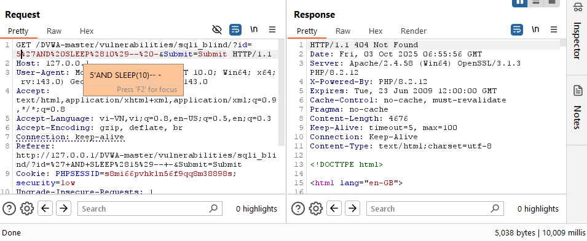
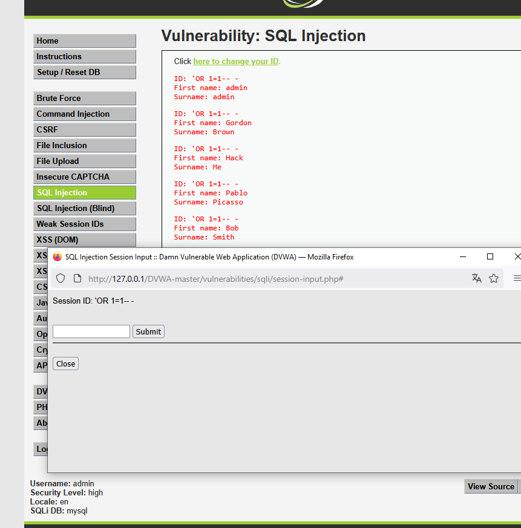

# Blind SQL Injection on /vulnerabilities/sqli_blind/
Mục tiêu: khai thác SQL Injection để làm trang trả về tất cả bản ghi (all users) thay vì chỉ 1 user.
# LOW
1.) Target

Target URL: `http://127.0.0.1/DVWA-master/vulnerabilities/sqli_blind/?id=5&Submit=Submit#`

Environment: Windows 10, XAMPP Apache/2.4.58, PHP 8.2.12, DVWA vX.Y, Burp Suite Community

Security level: low

2.) Tóm tắt POC

Payload `'AND SLEEP(10)-- -` chèn payload làm delay phía DB (SLEEP) để quan sát sự khác biệt thời gian phản hồi → server chậm đúng thời gian delay → truy vấn SQL được ghép nối.

3.) PoC (step-by-step)

1. Gửi request `http://127.0.0.1/DVWA-master/vulnerabilities/sqli_blind/?id=5&Submit=Submit#` vào burp repeater.
2. URL encode payload `'AND SLEEP(10)-- -` → `%27AND%20SLEEP%2810%29--%20-` và truyền vào sau số 5
3. Send request và quan sát response trả về
4. Response load 10s → blind SQL
5. Kết quả PoC cho lỗ hổng blind SQL Injection-low:

4.) Payload tested

`'AND SLEEP(10)-- -`

5.) Phân tích source code
`$id = $_GET[ 'id' ];`
`$query  = "SELECT first_name, last_name FROM users WHERE user_id = '$id';"`

- $id được ghép trực tiếp vào chuỗi SQL trong dấu nháy đơn:

`WHERE user_id = '$id';`

Vì $id đến từ input GET nên attacker có thể chèn payload như `'AND SLEEP(10)-- -` để thực hiện time-based blind SQLi.

# MEDIUM:
1.) Target

Target URL: `http://127.0.0.1/DVWA-master/vulnerabilities/sqli/`

Environment: Windows 10, XAMPP Apache/2.4.58, PHP 8.2.12, DVWA vX.Y, Burp Suite Community

Security level: medium

2.) Tóm tắt POC

Payload `AND SLEEP(10)-- -` chèn payload làm delay phía DB (SLEEP) để quan sát sự khác biệt thời gian phản hồi -> server chậm đúng thời gian delay -> truy vấn SQL được ghép nối.

3.) PoC (step-by-step)

1. Gửi request `http://127.0.0.1/DVWA-master/vulnerabilities/sqli_blind/` vào burp repeater.
2. Truyền payload `'AND SLEEP(10)-- -` vào sau số 1 của tham số id
3. Send request và quan sát response trả về
4. Hiển thị "There was an error" → có thể id nằm trong ""
5. Truyền payload `"AND SLEEP(10)-- -` vào sau số 1 của tham số id
6. Hiển thị "There was an error" → có thể id không nằm trong dấu nào cả
7. Truyền payload `AND SLEEP(10)-- -` vào sau số 1 của tham số id
8. Response load 10s → blind SQL
9. Kết quả PoC cho lỗ hổng blind SQL Injection-low:

4.) Payload tested

`AND SLEEP(10)`

5.) Phân tích source code
`$id = $_POST[ 'id' ];`
`$id = ((isset($GLOBALS["___mysqli_ston"]) && is_object($GLOBALS["___mysqli_ston"])) ? mysqli_real_escape_string($GLOBALS["___mysqli_ston"],  $id ) : ((trigger_error("[MySQLConverterToo] Fix the   mysql_escape_string() call! This code does not work.", E_USER_ERROR)) ? "" : ""));
 // Check database
 $query  = "SELECT first_name, last_name FROM users WHERE user_id = $id;";`
      
- Dev đã bỏ dấu nháy quanh $id (WHERE user_id = $id;) và dùng mysqli_real_escape_string() → payload có dấu nháy bị escape hoặc gây lỗi. Thay vì dùng dấu nháy thì chèn một biểu thức số hợp lệ `AND SLEEP(10)`, để câu SQL sau khi ghép trở thành WHERE user_id = 1 AND SLEEP(10)→ trang load 10s.

# HIGH
1.) Target

Target URL: `http://127.0.0.1/DVWA-master/vulnerabilities/sqli/?id=1&Submit=Submit#`

Environment: Windows 10, XAMPP Apache/2.4.58, PHP 8.2.12, DVWA vX.Y, Burp Suite Community

Security level: low

2.) Tóm tắt POC

Payload `'OR 1=1-- -` là một khai thác làm điều kiện WHERE luôn đúng và vì trang trả dữ liệu trực tiếp nên đây là in‑band SQL Injection.

3.) PoC (step-by-step)

1. Truy cập `http://127.0.0.1/DVWA-master/vulnerabilities/sqli/session-input.php#`
2. Nhập vào ô text payload `'OR 1=1-- -`.
3. Nhấn nút submit -> trang trả về tất cả bản ghi
4. Kết quả PoC cho lỗ hổng  in-band SQL Injection-high:

4.) Payload tested

`'OR 1=1-- -`

5.) Phân tích source code

`$query  = "SELECT first_name, last_name FROM users WHERE user_id = '$id' LIMIT 1;";`

- Code vẫn ghép $id trong dấu nháy (WHERE user_id = '$id') → payload bắt đầu bằng dấu nháy ('OR 1=1 -- -) sẽ đóng dấu nháy rồi chèn OR 1=1 kèm comment hết các lệnh đằng sau(LIMIT 1) → trả về mọi hàng.

