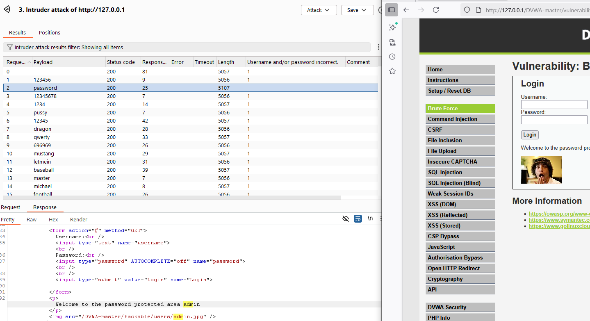

# Bruteforce /vulnerabilities/xss_s/
# LOW
- Mục tiêu: Bruteforce mật khẩu của admin

1.) Target
- Target URL: `http://127.0.0.1/DVWA-master/vulnerabilities/brute/?username=admin&password=guest&Login=Login#`
- Environment: Windows 10, XAMPP Apache/2.4.58, PHP 8.2.12, DVWA vX.Y, Burp Suite Community
- Security level: low

2.) Tóm tắt PoC

- Gửi request `http://127.0.0.1/DVWA-master/vulnerabilities/brute/?username=admin&password=guest&Login=Login#` sang chức năng Intruder của burp, brute force sniper attack vào tham số guest, dùng wordlist password để check

3.) PoC (step-by-step)
  1. Chuyển request GET tới URL trên và gửi sang Intruder.
  2. Đặt vị trí payload cho tham số `password` (thay `guest`).
  3. Chọn attack type = Sniper; Load Payload configuration: dùng wordlist(500-worst-passwords.txt).
  4. Add Grep - Match dòng Username and/or password incorrect.
  5. Quan sát cột Username and/or password incorrect(hoặc cột length) → thấy dòng khác thường → password đúng
  6. Kết quả PoC cho lỗ hổng Brute-force:
  
  .

4.) Phân tích source code
- Low level — login thất bại
`$html .= "<pre> Username and/or password incorrect.</pre>";`

# MEDIUM
1.) Target
- Target URL: `http://127.0.0.1/DVWA-master/vulnerabilities/brute/?username=admin&password=guest&Login=Login#`
- Environment: Windows 10, XAMPP Apache/2.4.58, PHP 8.2.12, DVWA vX.Y, Burp Suite Community
- Security level: medium

2.) Tóm tắt PoC

- Gửi request `http://127.0.0.1/DVWA-master/vulnerabilities/brute/?username=admin&password=guest&Login=Login#` sang chức năng Intruder của burp, brute force sniper attack vào tham số guest, dùng wordlist password để check

3.) PoC (step-by-step)
  1. Chuyển request GET tới URL trên và gửi sang Intruder.
  2. Đặt vị trí payload cho tham số `password` (thay `guest`).
  3. Chọn attack type = Sniper; Load Payload configuration: dùng wordlist(500-worst-passwords.txt).
  4. Add Grep - Match dòng Username and/or password incorrect.
  5. Quan sát cột Response received → thấy dòng trả về khác thường → password đúng
  6. Kết quả PoC cho lỗ hổng Brute-force:

  

4.) Phân tích source code
- Medium — delay cố định, sau khi kiểm tra DB nhưng login thất bại
`sleep(2); // dừng 2 giây để làm chậm brute-force
$html .= "<pre> Username and/or password incorrect.</pre>";`
# HIGH
- Mục tiêu: Bruteforce mật khẩu của admin

1.) Target
- Target URL: `http://127.0.0.1/DVWA-master/vulnerabilities/brute/?username=admin&password=guest&Login=Login#`
- Environment: Windows 10, XAMPP Apache/2.4.58, PHP 8.2.12, DVWA vX.Y, Burp Suite Community
- Security level: high

2.) Phân tích source code
- High — delay ngẫu nhiên, sau khi kiểm tra DB nhưng login thất bại và có user_token
`sleep( rand(0, 3) ); // delay ngẫu nhiên 0–3 giây, khó đo lường timing
$html .= "<pre> Username and/or password incorrect.</pre>";`
