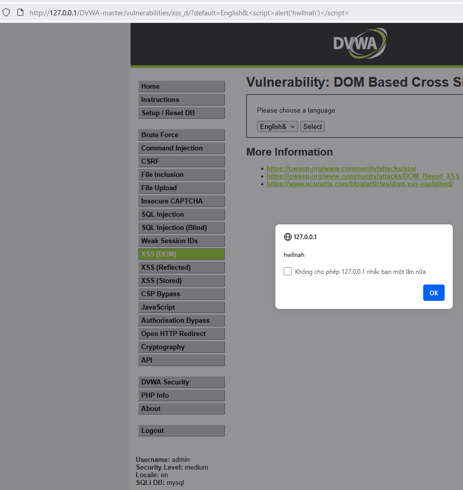
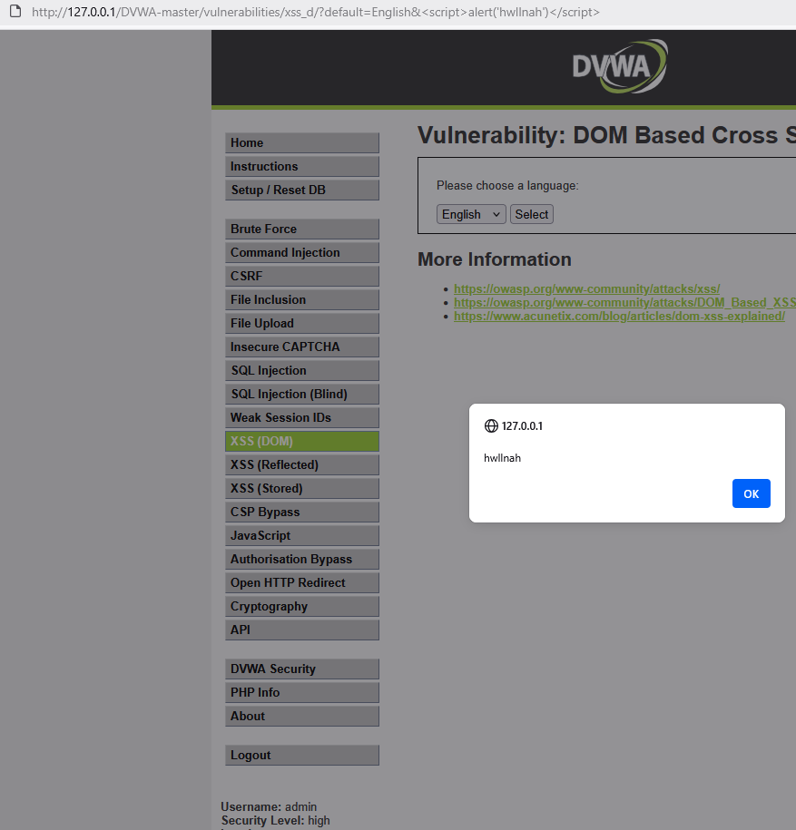

# DOM based XSS on /vulnerabilities/xss_d/
1. DOM được tạo bằng đối tượng được gọi là document, chứa một thuộc tính được gọi là URL. Khi trình phân tích cú pháp đến mã Javascript, nó sẽ thực thi mã đó và sửa đổi HTML thô của trang.
2. Bản thân trang web(response HTTP) không thay đổi, nhưng mã phía client có trong trang web lại thực thi khác đi do những sửa đổi độc hại đã xảy ra trong môi trường DOM.

# LOW

1.) Target

- Target URL: http://127.0.0.1/DVWA-master/vulnerabilities/xss_d/

- Environment: Windows 10, XAMPP Apache/2.4.58, PHP 8.2.12, DVWA vX.Y, Burp Suite Community

- Security level: low

2.) Tóm tắt

- Trang web lấy giá trị từ tham số default trong URL và chèn trực tiếp vào DOM bằng JavaScript. Nếu tham số này chứa payload độc hại, trình duyệt sẽ thực thi ngay trong ngữ cảnh trang mà không cần server lưu trữ hay thay đổi HTML gốc, dẫn tới DOM‑based XSS.

3.) PoC (step-by-step)

  1.Truy cập http://127.0.0.1/DVWA-master/vulnerabilities/xss_d/default=English.
  
  2.Dán payload `` vào thanh địa chỉ
  -> `http://127.0.0.1/DVWA-master/vulnerabilities/xss_d/?default=`
  
  3.Nhấn Enter để load trang.
  
  4.Quan sát: khi trang load sẽ hiện alert('hwllnah').
  
  5.Kết quả PoC cho lỗ hổng Stored XSS mức low:
  
  .
  
4.) Payload tested

``
# MEDIUM

1.) Target

- Target URL: http://127.0.0.1/DVWA-master/vulnerabilities/xss_d/

- Environment: Windows 10, XAMPP Apache/2.4.58, PHP 8.2.12, DVWA vX.Y, Burp Suite Community

- Security level: medium

2.) Tóm tắt

- Trang web lấy giá trị từ tham số default trong URL và chèn trực tiếp vào DOM bằng JavaScript. Nếu tham số này chứa payload độc hại, trình duyệt sẽ thực thi ngay trong ngữ cảnh trang mà không cần server lưu trữ hay thay đổi HTML gốc, dẫn tới DOM‑based XSS.

3.) PoC (step-by-step)

  1. Truy cập http://127.0.0.1/DVWA-master/vulnerabilities/xss_d/default=English
  
  2. Dán payload `` vào thanh địa chỉ
  -> http://127.0.0.1/DVWA-master/vulnerabilities/xss_d/?default=
  
  3.Nhấn Enter để load trang và quan sát thấy khi trang load không có gì xảy ra.
  
  4. Dán lại payload `` vào thanh địa chỉ, ngăn cách payload với tham số default bằng & (& là ký tự phân tách tham số trong url)
     
  -> `http://127.0.0.1/DVWA-master/vulnerabilities/xss_d/?default=English&`
  
  5. Nhấn Enter để load trang và quan sát: khi trang load đã hiện alert('hwllnah').

  6. Kết quả PoC cho lỗ hổng Stored XSS mức medium:
  
  .
  
4.) Payload tested

``

5.) Phân tích source code

`if (stripos ($default, "` vào thanh địa chỉ
  -> `http://127.0.0.1/DVWA-master/vulnerabilities/xss_d/?default=`
  
  3.Nhấn Enter để load trang và quan sát thấy khi trang load không có gì xảy ra.
  
  4. Dán lại payload `` vào thanh địa chỉ, ngăn cách payload với tham số default bằng & (& là ký tự phân tách tham số trong url)
     
  -> `http://127.0.0.1/DVWA-master/vulnerabilities/xss_d/?default=English&`
  
  5. Nhấn Enter để load trang và quan sát: khi trang load đã hiện alert('hwllnah').
   
  6.Kết quả PoC cho lỗ hổng Stored XSS mức high:
  
  .
  
4.) Payload tested

``

5.) Phân tích source code

  	switch ($_GET['default']) {
		case "French":
		case "English":
		case "German":
		case "Spanish":
			# ok
			break;
		default:
			header ("location: ?default=English");
			exit;
	}
  
- Đoạn PHP trên chỉ whitelist giá trị của default, nhưng không ngăn người dùng thêm tham số khác vào query string. Nếu phía client (JS) hoặc HTML của trang chèn toàn bộ query string (hoặc bất cứ tham số không được lọc) vào DOM bằng innerHTML / document.write / .html() mà không escape thì attacker có thể thêm &<script>... vào URL và gây DOM-based XSS.
