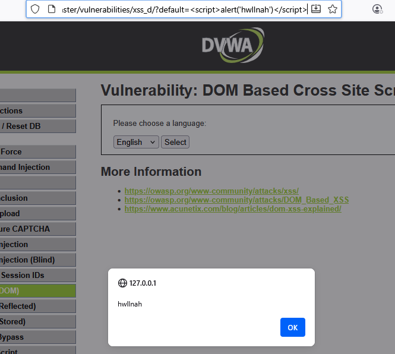

# DOM based XSS on /vulnerabilities/xss_d/
1. DOM được tạo bằng đối tượng được gọi là document, chứa một thuộc tính được gọi là URL. Khi trình phân tích cú pháp đến mã Javascript, nó sẽ thực thi mã đó và sửa đổi HTML thô của trang.
2. Bản thân trang web(response HTTP) không thay đổi, nhưng mã phía client có trong trang web lại thực thi khác đi do những sửa đổi độc hại đã xảy ra trong môi trường DOM.

# LOW

1.) Target

Target URL: http://127.0.0.1/DVWA-master/vulnerabilities/xss_d/

Environment: Windows 10, XAMPP Apache/2.4.58, PHP 8.2.12, DVWA vX.Y, Burp Suite Community

Security level: low

2.) Tóm tắt

Trang web lấy giá trị từ tham số default trong URL và chèn trực tiếp vào DOM bằng JavaScript. Nếu tham số này chứa payload độc hại, trình duyệt sẽ thực thi ngay trong ngữ cảnh trang mà không cần server lưu trữ hay thay đổi HTML gốc, dẫn tới DOM‑based XSS.

3.) PoC (step-by-step)

  1.Truy cập http://127.0.0.1/DVWA-master/vulnerabilities/xss_d/default=English.
  2.Dán payload  vào thanh địa chỉ -> http://127.0.0.1/DVWA-master/vulnerabilities/xss_d/?default=
  3.Nhấn Enter để load trang.
  4.Quan sát: khi trang load sẽ hiện alert('hwllnah').
  5.Kết quả PoC cho lỗ hổng Stored XSS: .
4.) Payload tested

