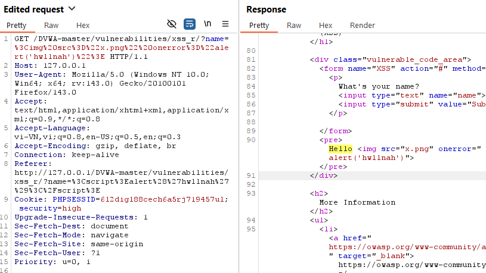

# XSS — Reflected on /vulnerabilities/xss_r/
# LOW
1.) Target
- Target URL: http://127.0.0.1/DVWA-master/vulnerabilities/xss_r/?name=
- Environment: Windows 10, XAMPP Apache/2.4.58, PHP 8.2.12, DVWA vX.Y, Burp Suite Community
- Security level: low

2.) Tóm tắt

Truyền payload  vào biến name, giá trị này được chèn thô vào trang mà không được escape dẫn tới thực thi mã JavaScript phía client.

3.) PoC (step-by-step)
1. Intercept request `/vulnerabilities/xss_r/?name=aaa`.
2. thay đổi param `aaa` với payload: ``.
3. Forward request → alert hwllnah xuất hiện trên browser.
4. Kết quả PoC cho lỗ hổng Reflected XSS:
.

4.) Payload tested

  
5.) Phân tích source code

source code có dòng: $html .= '<pre>Hello ' . $_GET[ 'name' ] . '</pre>';
//$_GET['name'] lấy trực tiếp dữ liệu từ URL mà không xử lý gì cả.

# MEDIUM
1.) Target
- Target URL: http://127.0.0.1/DVWA-master/vulnerabilities/xss_r/?name=
- Environment: Windows 10, XAMPP Apache/2.4.58, PHP 8.2.12, DVWA vX.Y, Burp Suite Community
- Security level: medium

2.) Tóm tắt

Vì server strip (loại bỏ) thẻ  không xuất hiện/không được parse => không chạy.
Ý tưởng thay thế: chèn một thẻ có handler (không phải `.
3. Forward request → mở Response → Raw / View Source. Do server strip thẻ <script> (thẻ mở bị xóa) nên payload không chạy.
4. Thử payload bypass (không dùng <script>): `` đã URL encode.
5. URL-encoded: %3Cimg%20src%3D%22x.png%22%20onerror%3D%22alert('hwllnah')%22%3E
6. Forward request → alert hwllnah xuất hiện trên browser.
7. Kết quả PoC cho lỗ hổng Reflected XSS: .

4.) Payload tested

5.)Phân tích source code

source code có dòng: $name = str_replace( '<script>', '', $_GET[ 'name' ] );
//$_GET[ 'name' ] đã có xử lý chặn <script>. Cách này chỉ loại bỏ chuỗi <script> đúng chuẩn, nhưng không chặn các biến thể viết hoa, có khoảng trắng, attribute khác, hoặc các event handler như onerror/onclick.

# HIGH
1.) Target
- Target URL: http://127.0.0.1/DVWA-master/vulnerabilities/xss_r/?name=
- Environment: Windows 10, XAMPP Apache/2.4.58, PHP 8.2.12, DVWA vX.Y, Burp Suite Community
- Security level: high

2.) Tóm tắt

Thay payload đã URL encode từ level medium vào high:%3Cimg%20src%3D%22x.png%22%20onerror%3D%22alert('hwllnah')%22%3E. vì không tìm thấy src nên onerror sẽ chạy JS.

3.) PoC (step-by-step)
1. Intercept request `/vulnerabilities/xss_r/?name=aaa`.
2. thay đổi param `aaa` với payload: `` đã URL encode.
5. URL-encoded: %3Cimg%20src%3D%22x.png%22%20onerror%3D%22alert('hwllnah')%22%3E
6. Forward request → alert hwllnah xuất hiện trên browser.
7. Kết quả PoC cho lỗ hổng Reflected XSS: .

4.) Payload tested

5.) Phân tích source code 

source code có dòng: $name = preg_replace( '/<(.*)s(.*)c(.*)r(.*)i(.*)p(.*)t/i', '', $_GET[ 'name' ] );
//$_GET['name'] đã được xử lý bằng preg_replace để loại bỏ các chuỗi <script> nhưng không chặn được các vector khác như event handler (onerror, onclick)

# Alert 

.

# FIX BUG
Dùng htmlspecialchars() để ngăn XSS, encode tất cả ký tự HTML đặc biệt trước khi hiển thị
