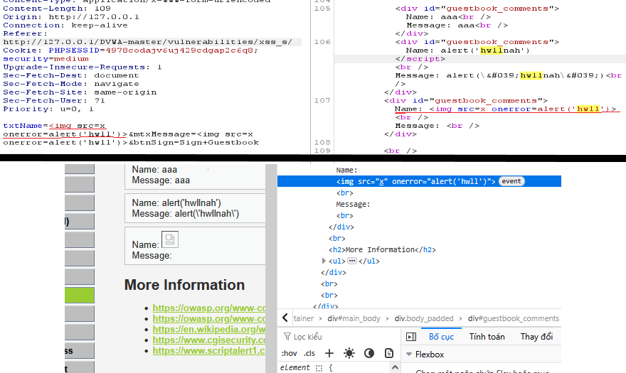
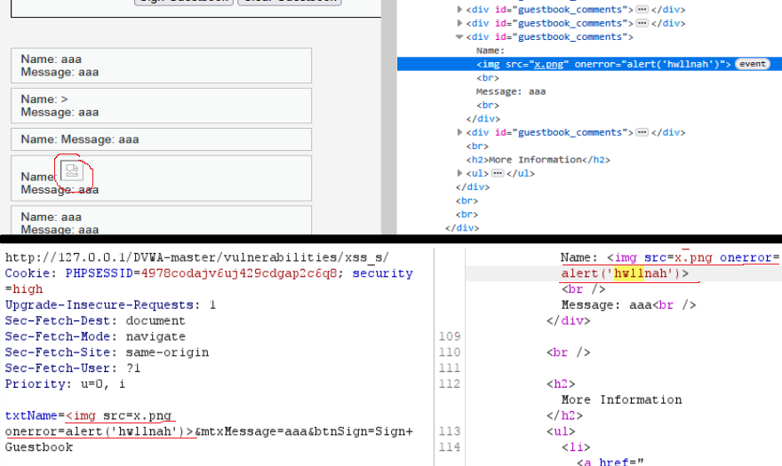

# XSS — Stored on /vulnerabilities/xss_s/
# LOW
1.) Target
- Target URL: http://127.0.0.1/DVWA-master/vulnerabilities/xss_s/
- Environment: Windows 10, XAMPP Apache/2.4.58, PHP 8.2.12, DVWA vX.Y, Burp Suite Community
- Security level: low

2.) Tóm tắt 

Truyền payload  vào các trường name và message. Hai giá trị này được lưu thô vào cơ sở dữ liệu và khi trang hiển thị lại thì nội dung không được escape → JavaScript được thực thi trên trình duyệt của client.

3.) PoC (step-by-step)
  1. Intercept request /vulnerabilities/xss_s/.
  2. Thay đổi giá trị txtName và mtxMessage thành payload: .
  3. Forward request. Khi load trang, alert('hwll') xuất hiện (xuất hiện 2 lần vì cả 2 trường đều chứa payload).
  4. Kết quả PoC cho lỗ hổng Stored XSS:
  .

4.) Payload tested

5.) Phân tích source code

- Hai trường name và message được lưu thô vào database và chèn trực tiếp vào trang HTML khi hiển thị, không có bước HTML-escaping hay lọc input. Do đó payload  sẽ được lưu vào DB và thực thi trên trình duyệt của người dùng (Stored XSS)

# MEDIUM
1.) Target
- Target URL: http://127.0.0.1/DVWA-master/vulnerabilities/xss_s/
- Environment: Windows 10, XAMPP Apache/2.4.58, PHP 8.2.12, DVWA vX.Y, Burp Suite Community
- Security level: medium

2.) Tóm tắt 

 bị strip/escaped (tại chỗ xử lý server) nên không thực thi. Tuy nhiên lọc hiện tại không loại trừ các thẻ/attribute nguy hiểm khác (như ), nên có thể dùng attribute event để thực thi JS. Kết quả: do xử lý không đồng nhất/không whitelisting, ứng dụng vẫn bị Stored XSS qua trường name.

3.) PoC (step-by-step)
  1. Intercept request /vulnerabilities/xss_s/.
  2. Thay đổi giá trị txtName và mtxMessage thành payload: .
  3. Forward request → mở Response quan sát, thấy thẻ , không loại bỏ event attributes (onerror), không loại bỏ tag khác như  hay <svg onload=...>.

# HIGH
1.) Target
- Target URL: http://127.0.0.1/DVWA-master/vulnerabilities/xss_s/
- Environment: Windows 10, XAMPP Apache/2.4.58, PHP 8.2.12, DVWA vX.Y, Burp Suite Community
- Security level: high

2.) Tóm tắt 

Truyền payload  vào các trường name và message. Hai giá trị này được lưu thô vào cơ sở dữ liệu và khi trang hiển thị lại thì nội dung không được escape → JavaScript được thực thi trên trình duyệt của client.

3.) PoC (step-by-step)
  1. Intercept request /vulnerabilities/xss_s/.
  2. Thay đổi giá trị txtName và mtxMessage thành payload: .
  3. Forward request → mở Response quan sát, thấy thẻ , không loại bỏ event attributes (onerror), không loại bỏ tag khác như  hay <svg onload=...>.
# Alert img
.
